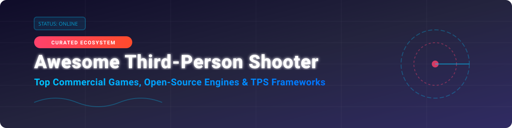

# Awesome Third-Person Shooter (TPS) Video Game Ecosystem 🎮 🔫

  
  
  
  

## 🎯 Top Third-Person Shooter Video Game Ecosystem

**Curated List of Commercial TPS SaaS/Hosted Games, Open-Source GitHub Projects, Game Engines & TPS Templates** 🚀

*Focused on Open-Source Shooters, Game Engines & TPS Templates for Developers and Gamers* 🕹️

**Last updated: October 2026** 📅

This repository tracks notable **commercial third-person shooters** and **open-source projects** that provide production-ready TPS frameworks, multiplayer engines, character controllers, and complete open-source shooter games. The TPS (Third-Person Shooter) genre is defined by camera placement behind and above the character, enabling tactical awareness, cover mechanics, and character-driven combat.

---

## 📑 Table of Contents
- [📊 Market Overview & Industry Dynamics](#-market-overview--industry-dynamics)
- [🎮 Commercial & SaaS TPS Video Games](#-commercial--saas-tps-video-games)
- [💻 Open-Source GitHub Projects](#-open-source-github-projects)
- [🤝 How to Contribute](#-how-to-contribute)
- [💖 Support & Sponsorship](#-support--sponsorship)
- [📈 Star History](#-star-history)
- [⚠️ Disclaimer](#%EF%B8%8F-disclaimer)

---

## 📊 Market Overview & Industry Dynamics

The global Third-Person Shooter (TPS) and Action-Shooter market size is estimated at **$18.5 Billion (2026)** with steady annual growth driven by live-service games, battle royale modes, and cross-platform multiplayer. The sector is **moderately fragmented**: while dominant mega-franchises (such as *Gears of War*, *Warframe*, and *The Division*) capture the majority of concurrent live-service revenues, mid-tier AA studios, indie developers, and open-source game engines (Godot, Unreal Engine 5, O3DE) maintain a thriving competitive landscape with specialized gameplay innovations.

---

## 🎮 Commercial & SaaS TPS Video Games

Below is a breakdown of top commercial third-person shooter games, live-service titles, and hosted platforms, sorted by estimated company revenue / market valuation (descending).

| Game / Platform 🎮 | Developer / Parent Company 🏢 | Est. Valuation / Annual Revenue 💰 | Base Pricing Tier 🏷️ | Free Tier / Trial Limit 🎁 | Description & Genre Focus 📝 |
| :--- | :--- | :--- | :--- | :--- | :--- |
| **[Gears of War](https://www.gearsofwar.com/)** | Microsoft / Xbox Game Studios | **$3.1 Trillion** (Parent Valuation) | $59.99 (or $11.99/mo Xbox Game Pass) | 14-Day Game Pass Ultimate Trial ($1) | Microsoft's flagship TPS franchise with cover-based combat, co-op campaigns, and Horde mode. Established modern cover mechanics. |
| **[Tom Clancy's The Division 2](https://www.ubisoft.com/game/the-division-2)** | Ubisoft | **$2.8 Billion** (Market Cap) | $29.99 (Standard Edition) | 8-Hour / Level 8 Free Trial | Open-world looter-shooter with RPG mechanics, Washington D.C. setting, and Dark Zone PvP combat. |
| **[Max Payne 3](https://www.rockstargames.com/maxpayne3)** | Rockstar Games / Take-Two | **$26.4 Billion** (Parent Market Cap) | $19.99 (Standard Edition) | No Free Trial (Paid purchase required) | Stylish TPS with bullet-time slow-motion mechanics and cinematic presentation. |
| **[Army of Two](https://www.ea.com/games/army-of-two)** | EA (Electronic Arts) | **$38.5 Billion** (Market Cap) | $19.99 (Console Base Price) | No Free Trial (Paid purchase required) | Co-op focused TPS centered on two-player tactics, aggro manipulation, and partner interaction. |
| **[Binary Domain](https://www.binarydomain.com/)** | Sega | **$3.6 Billion** (Parent Market Cap) | $14.99 (Steam Base Price) | 2-Hour Steam Refund Window | Sci-fi TPS with squad voice commands, consequence systems, and procedural robot destruction. |
| **[Warframe](https://www.warframe.com/)** | Digital Extremes / Tencent | **$450 Billion** (Parent Valuation) | $0.00 (Free-to-Play) | Free-to-Play Forever (Full game content accessible without paywalls) | Fast-paced space ninja TPS with extensive customization, parkour locomotion, and continuous content expansions. |
| **[Vanquish](https://www.vanquishgame.com/)** | PlatinumGames / Sega | **$3.6 Billion** (Publisher Market Cap) | $19.99 (Standard Edition) | Free PC Demo on Steam | High-speed sliding action TPS with frenetic bullet-hell combat and boss battles. |
| **[Outriders](https://www.outriders.com/)** | People Can Fly / Square Enix | **$5.2 Billion** (Publisher Market Cap) | $39.99 (Standard Edition) | Free Unlimited Demo (Chapter 1 & character transfer) | Co-op RPG shooter featuring aggressive class abilities, skill trees, and extensive loot systems. |
| **[Remnant 2](https://www.remnantgame.com/)** | Gunfire Games / Embracer Group | **$2.1 Billion** (Parent Market Cap) | $49.99 (Standard Edition) | No Free Trial (Paid purchase required) | Souls-like TPS featuring procedural dynamic world generation, archetype classes, and challenging co-op boss fights. |
| **[Spec Ops: The Line](https://www.specopstheline.com/)** | Yager Development / Tencent | **$450 Billion** (Parent Valuation) | $29.99 (Base Edition) | Free PC Demo on Steam | Narrative-driven tactical TPS known for moral dilemmas, sand physics, and psychological depth. |

---

## 💻 Open-Source GitHub Projects

Open-source third-person shooter repositories, game engine frameworks, and character controllers, sorted by GitHub Stars_Count (descending) 🌟.

| Project & Repo Stars_Badge 🏅 | GitHub_Stars ⭐ | Primary Tech Stack 🛠️ | Description & Features 📌 |
| :--- | :--- | :--- | :--- |
| **[Godot Engine](https://github.com/godotengine/godot)**  | **85,000+** | C++, GDScript | Feature-packed open-source 2D/3D game engine. Provides the underlying architecture for top open-source TPS demos. |
| **[Godot Third Person Shooter Demo](https://github.com/godotengine/tps-demo)**  | **1,400+** | GDScript, Godot Engine | **Official Godot Engine TPS reference implementation**. High-quality 3D assets, PBR materials, dynamic lighting, and character controller. |
| **[GDQuest Godot 4 3D Third-Person Controller](https://github.com/gdquest-demos/godot-4-3d-third-person-controller)**  | **1,000+** | GDScript, Godot 4 | Plug-and-play 3D TPS character controller inspired by Ratchet & Clank. Features camera orbit, smooth locomotion, and jump physics. |
| **[RobustToolbox](https://github.com/space-wizards/RobustToolbox)**  | **695+** | C#, .NET | Robust multiplayer game engine framework powering Space Station 14. Excellent base for building networked multiplayer TPS projects. |
| **[Open 3D Engine (O3DE)](https://github.com/o3de/o3de)**  | **650+** | C++, Python | AAA-capable open-source 3D engine from Open 3D Foundation, powering mobile TPS games like MadWorld. |
| **[Fyrox Engine](https://github.com/FyroxEngine/Fyrox)**  | **600+** | Rust | Feature-rich 3D/2D Rust game engine with scene editor and built-in networking. Powers RustCycles multiplayer shooter. |
| **[Eternal Crusade Resurrection (ECR)](https://github.com/JediKnightChan/EternalCrusadeResurrection)**  | **120+** | C++, Unreal Engine 5 | Complete UE5 multiplayer TPS C++ template based on Lyra. Includes GAS gameplay abilities, vehicle pawns, and EOS matchmaking. |
| **[Third Person Shooter with Shooter AI](https://github.com/baponkar/Third-Person-Shooter-With-Shooter-AI)**  | **85+** | C#, Unity | Unity TPS starter template with state-machine NPC shooter AI. Includes cover behavior, weapon switching, minimap, and NavMesh AI. |
| **[RustCycles](https://github.com/rustcycles/rustcycles)**  | **45+** | Rust, Fyrox Engine | Fast multiplayer arena TPS written in Rust. Focuses on movement mechanics, open AGPLv3 license, and cross-platform native/WebAssembly builds. |
| **[Yet Another Zombie Horror (YAZH)](https://github.com/UstymUkhman/YetAnotherZombieHorror)**  | **32+** | TypeScript, Three.js, Svelte | Web-based 1st/3rd person zombie survival game running in-browser or desktop Electron. Features configurable physics engines and lighting. |
| **[Third Person Shooter Controller (Gears-inspired)](https://github.com/ishandutta2007/Awesome-Awesome-Awesome)**  | **29+** | C#, Unity | Unity TPS controller inspired by Gears of War cover mechanics and wall-bouncing physics. |
| **[Gode TPS Demo](https://github.com/godothub/gode-tps-demo)**  | **15+** | TypeScript, Godot Engine | Godot 3D TPS demo implemented with TypeScript bindings via Gode, supporting gamepad controls and aim toggles. |

---

## 🤝 How to Contribute

Contributions are warmly welcomed! Help make this the most comprehensive Third-Person Shooter repository on GitHub 🌟.

1. **Fork** the repository 🍴
2. **Add/Edit** entries in `README.md` following the table format 📝
3. Ensure entries include project name, link, Stars_Badge, accurate pricing/metrics, and description.
4. **Submit a Pull Request** with a clear explanation of your additions 🚀

---

## 💖 Support & Sponsorship

If you find this repository helpful for your game development research or finding TPS templates, please consider giving it a ⭐ star, sharing it with fellow developers, or supporting future maintenance!

- 🌟 **Star & Fork**: Click the Star button at the top right of this repo!
- 📢 **Share**: Post on Twitter/X, Discord, or LinkedIn.
- ☕ **Sponsor**: Buy me a coffee via [GitHub Sponsors](https://github.com/sponsors/ishandutta2007)!

---

## 📈 Star History

---

## ⚠️ Disclaimer

- This list is **community-curated** for educational, research, and resource-sharing purposes.
- Open-source TPS projects vary in maturity: *RustCycles* is an experimental prototype, whereas *Godot TPS Demo* is a polished reference implementation.
- All product names, logos, and brands are property of their respective owners.
